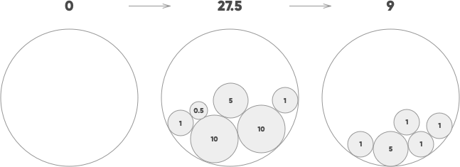

Part of the Conio's strategy is to visually represent the user's wallet with a physical simulation. You can see a preview on [our website](https://www.conio.com).



The objective of this exercise is to code the Model class. Here a JS sample of the usage:

```javascript
var ConioWallet = require('./') // <- this is the file you make;

var wallet = new ConioWallet()
console.log(wallet.getAmount()) // 0

wallet.addCoin(1);
wallet.addCoin(5);
wallet.addCoin(0.1);
wallet.addCoin(10);
console.log(wallet.getCoins()) // [0.1, 1, 5, 10]

console.log(wallet.addAmount(1.3)) // [{action: 'add', value:0.1, count:3}, {action: 'add', value:1, count:1}]
console.log(wallet.getAmount()) // 1.3
console.log(wallet.addAmount(14)) // [{action: 'remove', value:1, count:1}, {action: 'add', value:5, count:1}, {action: 'add', value:10, count:1}]
console.log(wallet.getAmount()) // 15.3
console.log(wallet.removeAmount(2)) // [{action: 'remove', value:5, count:1}, {action: 'add', value:1, count:3}]
console.log(wallet.getAmount()) // 13.3
```

## Rules
- Use the language required from the job opening. If you decide to use a specific version of the language, explain why.
- Write the tests.
- Analyze corner cases.
- If something is not clear, don't esitate to communicate with us.

